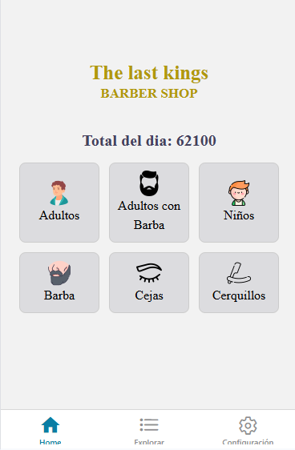
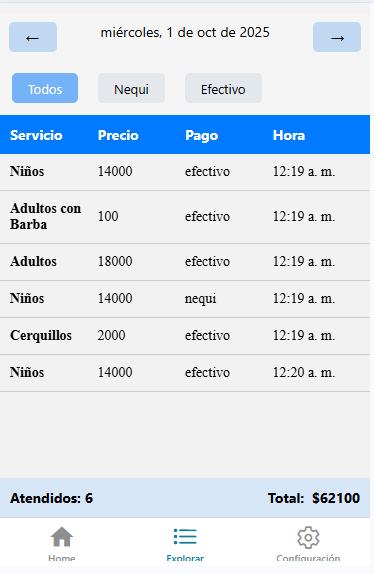
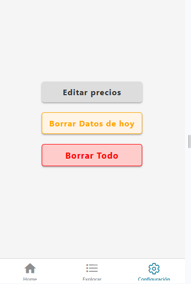

# 💈 BarberApp - React Native (Expo)

BarberApp is a mobile application built with **React Native** and **Expo**, designed specifically for barbershops to manage daily services and earnings. The app provides a clean, offline-friendly interface that allows barbers to track services performed, calculate daily revenue, and manage service pricing.

---

## ✂️ Features

- 💇 Services for:
  - Men
  - Children
  - Beard
  - Eyebrows
  - Hairlines (Edges)

- 💾 Data Storage:
  - Saves all service and earnings data locally using device storage
  - Persistent storage even after the app is closed

- 📊 Earnings Overview:
  - Displays total earnings for the current day
  - Historical data view of previous days’ totals

- 📋 Service Table:
  - Shows a list of services provided each day
  - View past records to analyze trends and performance

- 🛠️ Service Management:
  - Edit pricing for each type of service
  - Delete daily data
  - Clear all historical records

---

## 🖼️ Screenshots

Add screenshots here to visually showcase the app’s UI and features.

### 🟦 Home Page

### 🟨 Historical Data

### 🟩 Configurations

